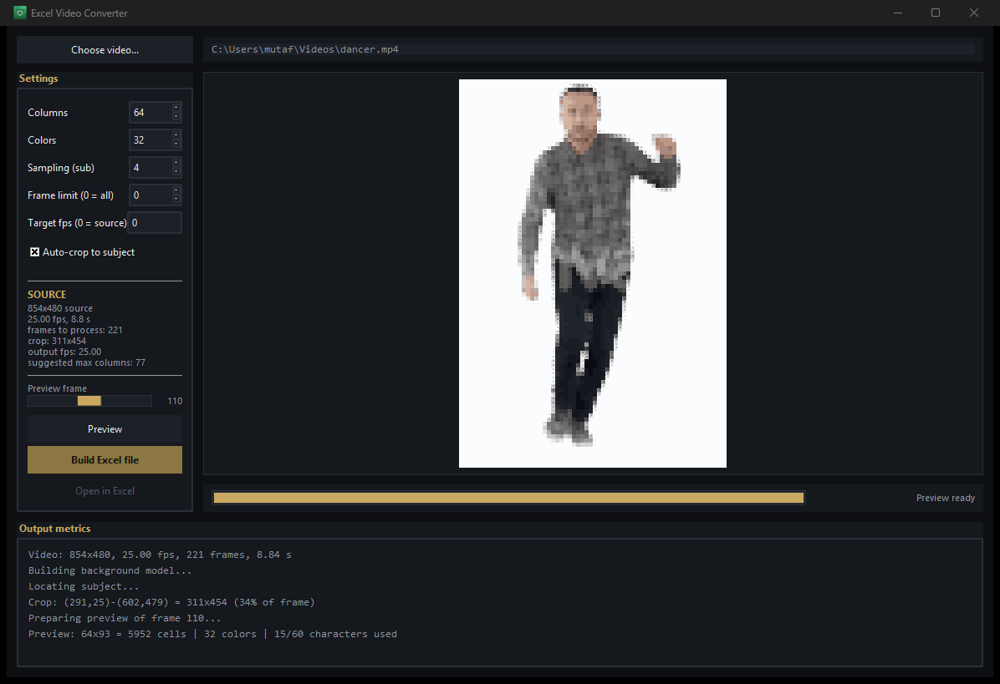
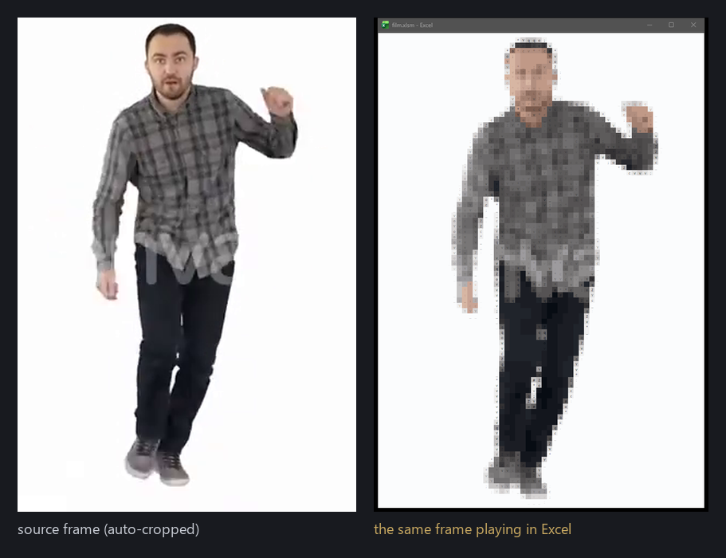
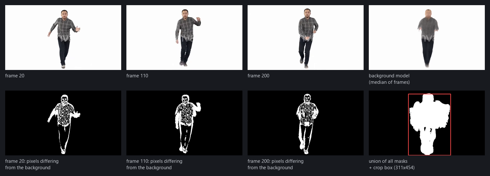

# Excel Video Converter

Turns a video into a mosaic of Excel cells and produces a macro-enabled workbook
that plays it back inside Excel — no image objects, no embedded media. Every
frame is thousands of coloured cells with a character in each one.

## Screenshots





## How it plays back

The core design decision: **Excel does no work at playback time.** All painting
happens during generation, in Python. Every frame is pre-rendered onto a single
worksheet, stacked vertically, and the embedded macro only scrolls the window:

```vba
ActiveWindow.ScrollRow = i * mRows + 1
```

This was not the obvious choice. Four strategies were benchmarked in real Excel
with the window visible and repainting (`scripts/benchmark.py`), on a
96 × 140 = 13,440-cell grid over 25 frames:

| Strategy | ms per frame | fps |
|---|---:|---:|
| Conditional formatting (64 rules) | 5294 | 0.2 |
| Cell-by-cell `Interior.Color` | 4787 | 0.2 |
| Pre-painted separate worksheets | 88 | 11.4 |
| **Single-sheet strip + window scroll** | **79** | **12.7** |

Conditional formatting was expected to win — pushing the work into Excel's own
engine — and it lost by a factor of 60. On 13,440 cells, 64 rules means roughly
860,000 formula evaluations per frame.

## Quick start

```powershell
python -m venv .venv
.venv\Scripts\python.exe -m pip install -r requirements.txt
```

Desktop application:

```powershell
.venv\Scripts\python.exe -m excelvid.gui
```

or double-click `run.bat`, which starts the same application without a console
window.

Command line — three commands, `video`, `frame` and `image`:

```powershell
# Build a playable workbook
.venv\Scripts\python.exe -m excelvid.cli video input.mp4 -o out/film.xlsm --cols 64

# Convert a single frame, to check quality quickly
.venv\Scripts\python.exe -m excelvid.cli frame input.mp4 -i 110 -o out/frame.xlsx

# Convert a still image
.venv\Scripts\python.exe -m excelvid.cli image photo.jpg -o out/still.xlsx
```

Open the `.xlsm`, click **Enable Content**, then **Ctrl+Shift+P** to play and
**ESC** to stop. Alt+F8 also lists `Play`, `PlayOnce`, `StopPlay` and `Restore`.
`ShowFrame(i)` takes an argument and `FrameReport` returns a string, so neither
appears in that dialog — call them from the Immediate window (Ctrl+G).

The virtual environment stores absolute paths, so moving or renaming the project
folder breaks the launcher shims in `.venv\Scripts` (`pip.exe` and friends);
`python.exe -m pip` keeps working. Delete `.venv` and repeat the two commands
above after a move.

## Requirements

- **Conversion needs no Excel.** The player macro is embedded as a pre-compiled
  `excelvid/vbaProject.bin` and the workbook is written directly by XlsxWriter.
- **Playback needs desktop Excel on Windows.** Excel Online and mobile do not
  run VBA (Visual Basic for Applications).
- `scripts/build_vba_project.py` is the only step that needs Excel, and only
  when the VBA source changes. It requires *Trust access to the VBA project
  object model* in Trust Center.

## Tech stack

| Layer | Technology | Used for |
|---|---|---|
| Video I/O | OpenCV | Decoding, resizing, colour conversion, connected components |
| Numerics | NumPy | All pixel maths, vectorised over whole frames |
| Glyphs | Pillow | Measuring how much ink each character covers |
| Workbook | XlsxWriter | Writing `.xlsx` / `.xlsm` without Excel |
| Player | VBA + `winmm.dll` | Window scrolling, frame pacing, framing |
| Desktop UI | Tkinter / ttk | Settings, live preview, progress |
| CLI | Typer | Scripted conversion |
| Excel automation | pywin32 (COM) | Compiling the VBA project once |

There is no scikit-learn: the palette needs one k-means call, and pulling in
scikit-learn plus SciPy cost 155 MB for it. The NumPy implementation in
`quantize.py` was measured against it on real data — twice as fast, mean error
1.18 vs 1.08 ΔE (both below the threshold of visibility), and a *better* worst
case (17.5 vs 21.7).

## How a frame becomes cells

Each cell carries **two colours**, not one. The pixels falling inside a cell are
split into dark and light groups by luminance; the dark group's mean becomes the
font colour, the light group's mean becomes the fill, and the dark fraction
selects the character. A plain average would have thrown away every edge inside
a cell and turned the image into a colour blur.

If the luminance standard deviation inside a cell is below a threshold, the cell
is treated as flat: no character is written. Without that threshold, compression
noise on a flat background split randomly into dark/light and printed characters
on empty space. Fixing it improved both appearance and speed:

| Grid | before | after |
|---|---:|---:|
| 96 × 140 | 12.7 fps | 18.1 fps |
| 64 × 93 | 24.2 fps | 33.5 fps |

Character selection is measured, not guessed: every candidate ASCII glyph is
rendered with Pillow and its ink coverage is measured, then duplicates by
density are dropped. Colour matching happens in CIE Lab, because Euclidean
distance in RGB does not match perceived difference.

## Auto-cropping

Subjects usually occupy a small part of the frame, so most of the grid and most
of the palette would be spent on empty background. The background is modelled as
the **median** of sampled frames — a mean leaves a ghost wherever the subject
passed. Pixels deviating from that model are masked per frame, and all masks are
unioned into **one** crop box for the whole video. Cropping per frame would slide
the background around the subject and look like a shaking camera.



## Cell geometry

Excel measures column width in characters and row height in points. For the
default style:

```
width_px  = 7 * w + 5
height_px = pt * 96 / 72
```

Square cells therefore need `w = 15/7 = 2.142857` against a 15 pt row. If this
is wrong the image is silently stretched. Measured in Excel: column 15 pt,
row 15 pt, visible rows 92.92 against a 93-row frame — no bleed from the next
frame.

## Performance

Measured on Microsoft 365 Excel (64-bit), 854 × 480 source, 221 frames:

| Measurement | Value |
|---|---|
| Grid | 64 × 93 = 5,952 cells |
| Source duration | 8.84 s at 25.00 fps |
| Playback duration | 9.12 s (24.2 fps) |
| Output size | 4.0 MB |
| Unique cell formats | 498 (limit is 64,000) |
| Generation time | ~9 s |

64 columns is the default because it clears the source frame rate with room to
spare. 96 columns holds more detail but drops to 18 fps, and for this source it
also exceeds what the pixels can actually feed.

## Source resolution does not raise quality

Each cell samples `sub × sub` = 16 pixels. Beyond that, extra source pixels
change nothing. Measured on one frame at a fixed 64 × 93 grid:

| Source | Mean colour error (ΔE) |
|---|---:|
| 4× upscaled | 0.30 |
| original (311 × 454) | 0 |
| downscaled to exactly 256 × 372 | 0.28 |
| half | 1.32 |
| quarter | 2.81 |
| one pixel per cell | 4.21 |

What matters is the resolution of the *cropped subject*, not the frame. The
application shows the ceiling ("suggested max columns") and warns when the
column count exceeds what the source can feed with real pixels.

## Test suite

```powershell
.venv\Scripts\python.exe -m pip install -r requirements-dev.txt
.venv\Scripts\python.exe -m pytest tests -q
```

41 tests, no Excel required — an `.xlsm` is a zip archive, so the workbook
structure is verified by reading it directly. Test data is synthesised in
`tests/conftest.py` rather than committed as binaries, so it is deterministic
and carries no licensing baggage.

Covered: cell squareness, aspect-preserving grid maths, flat-cell suppression,
`sub` bounding coverage resolution, palette sharing across frames, settings
clamping, frame row layout in the strip, the hidden config sheet, the format
count staying under the XLSX limit, and the VBA source containing no unresolved
placeholders.

## Project structure

```
excelvid/
  video.py        Decoding, background model, subject box
  render.py       Frame to cell grid (two colours + coverage)
  glyphs.py       Glyph ink-coverage measurement
  quantize.py     Palette k-means in CIE Lab, nearest-colour mapping
  pipeline.py     Frame sequence to shared palette + mosaic
  writer.py       Strip worksheet and hidden config sheet
  player_vba.py   Player macro source (fixed, not templated)
  player.py       Mosaic to .xlsm
  convert.py      Shared conversion logic, settings limits, progress reporting
  cli.py          Typer commands: video, frame, image
  gui.py          Desktop application
  theme.py        Dark theme and button pulse
  excel_com.py    Excel COM helpers (build and benchmark scripts only)
  vba_src.py      VBA sources injected for benchmarking
  vbaProject.bin  Pre-compiled player macro
scripts/
  build_vba_project.py   Compiles the macro once (needs Excel)
  benchmark.py           Measures playback strategies in real Excel
  make_icon.py           Builds the app icon from assets/icon-source.jpg
tests/                   Pytest suite, no Excel required
run.bat                  Starts the desktop application
```

## How the macro is embedded

The VBA source is **fixed** — it does not change per video. Grid dimensions and
frame rate are written into a hidden `cfg` worksheet and read at playback time.
That is what allows the macro to be compiled once and embedded as a binary,
which is why conversion needs no Excel at all.

The document module code names of the embedded project must match the sheets
XlsxWriter creates (`ThisWorkbook`, `Sheet1`, `Sheet2`). When they did not, Excel
carried both sets and the workbook ended up with orphan modules.

## Known limitations

- **Silent.** No audio track; syncing sound to a scroll loop is not attempted.
- **Auto-crop assumes a static camera.** With a moving camera the difference
  mask lights up everywhere and the box covers the whole frame — it degrades to
  "no crop" rather than failing. Turn the checkbox off for such footage.
- **Frames are held in memory.** Long or large-resolution clips scale linearly
  in RAM.
- **Excel's row limit is the ceiling on length.** Rows per frame × frame count
  must stay under 1,048,576 — about 7.5 minutes at 64 columns and 25 fps.
- **The estimated playback rate is not shown yet.** Raising the column count
  produces a file that plays slower than real time with no warning beforehand.
- **Palette is capped at 32 colours** to stay clear of the 64,000 unique cell
  format limit.

## Attribution

`samples/dancer.mp4` is third-party stock footage used for local testing and
benchmarking only.
